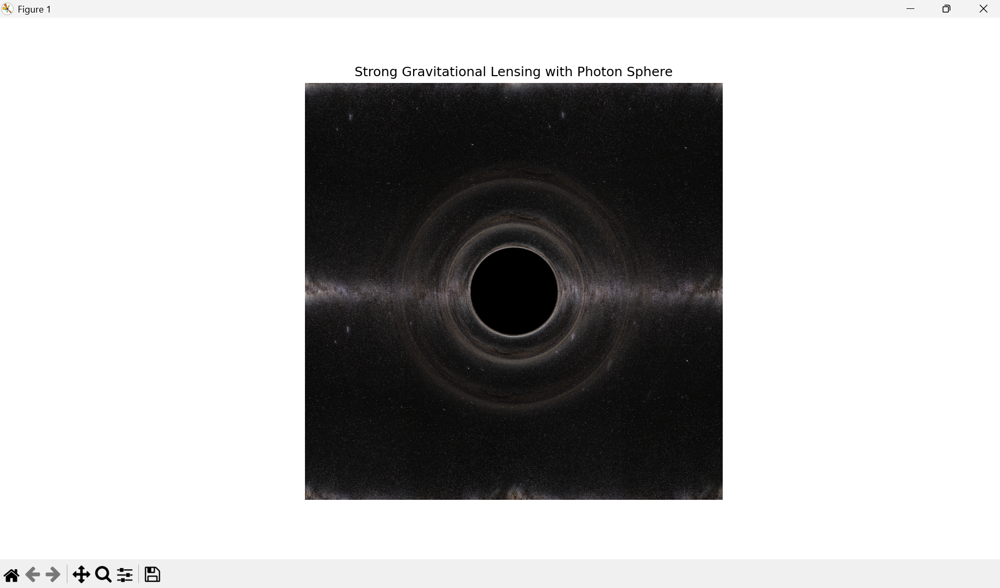

# Strong Gravitational Lensing by a Schwarzschild Black Hole

## Overview
This project provides a numerical simulation of **strong gravitational lensing by a Schwarzschild black hole** using an inverse ray-shooting approach. By tracing light rays backward from a distant observer to a background source plane, the simulation recreates important strong-field lensing features such as the **black hole shadow**, **photon-sphere ring**, and **multiple higher-order Einstein rings**.

The main goal of this project is to visualize and understand how spacetime curvature near a black hole changes the path of light where General Relativistic effects are significant.

---
## Results

**Figure 1:** Simulated strong gravitational lensing by a Schwarzschild black hole. The image shows the central black hole shadow, the bright photon-sphere ring, and multiple higher-order Einstein rings.

The distortion of the background source demonstrates the extreme bending of light predicted by General Relativity in the strong-gravity regime.

---
## Scientific Background  
In General Relativity, light follows null geodesics in curved spacetime. Near a black hole, light bending becomes very strong, resulting in multiple images of background sources. Photons that come close to a critical value can orbit the black hole several times near the **photon sphere** before they escape to the observer. This creates a series of increasingly narrow and faint Einstein rings.  

This project focuses on Schwarzschild spacetime. It offers a clear and straightforward environment to study strong gravitational lensing without issues from black hole rotation or emission physics.

---
## Methodology  
The simulation uses an **inverse ray-shooting technique**. Light rays are traced backwards from the observer’s image plane to a background source image.  

The main steps are:  
- Define an observer screen and a distant background image.  
- Assign an impact parameter to each pixel on the observer screen.  
- Compute the gravitational deflection angle based on the impact parameter.  
- Map deflected rays onto the background image.  
- Superimpose multiple winding photon paths to capture higher-order lensing effects.  

To highlight strong-field behavior near the photon sphere, a simple deflection model is used. It reproduces logarithmic divergence close to the critical impact parameter.  

---
## Simulation Setup
- **Black hole:** Schwarzschild (non-rotating)
- **Observer:** Static, far from the black hole
- **Light rays:** Null geodesics (geometric optics limit)
- **Units:** Geometrized units ( \( G = c = 1 \) )
- **Image resolution:** Configurable (typically \( N \sim 1000 \)–\(1200 \))

---
## Key Features Demonstrated
- Black hole shadow and photon-sphere structure
- Multiple Einstein rings from higher-order photon orbits
- Strong angular distortion of background sources
- Visualization of strong-field General Relativity effects

---
